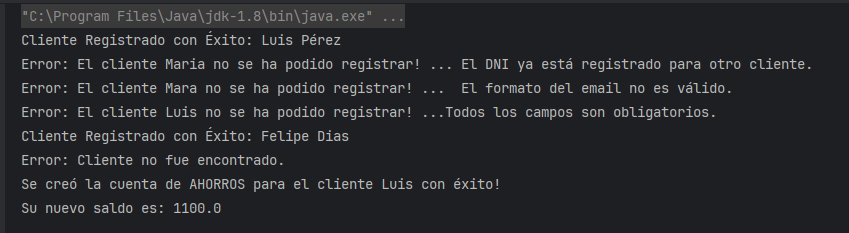

# Proyect 1 - Sistema Gestión Clientes y sus Ctas Bancarias

## 1. Diagrama UML - Bank System

## 2. Requisitos Funcionales

### 2.1 Funcionalidades del Sistema

+ El sistema permite **Registrar Cliente** con sus atributos.
+ El sistema permite **Abrir** una o más **cuentas bancarias**.
+ El sistema permite identificar **2 tipos de cuenta: Ahorros y Corriente**.
+ El sistema permite **Realizar Depósitos**.
+ El sistema permite **Realizar Retiros**.
+ El sistema permite **Consultar Saldos** de sus cuentas.

#### 2.1.1 Reglas del Negocio:

+ El DNI es único para cada cliente
+ El email tiene un formato válido.
+ El cliente se crea únicamente con todos sus campos.

#### 2.1.2 Validaciones de Cuenta Bancaria:
+ Al abrir una cuenta bancaria, se identifica que el cliente existe.
+ El número de cuenta es único y generado automáticamente por el sistema.
+ El tipo de cuenta será: Ahorros o Corriente

### 2.2 Herramientas

+ Aplicación de diagramas UMl
+ Drawio
+ Java 8, 11 o 17
+ IntelliJ IDEA
+ POO
+ HashMAp o ArrayList
+ SQL Básico (Mysql) - (OPCIONAL)

## 3. Ejecución

Sólo es necesario abrir el proyecto en el IDE y ejecutarlo.

## 4. Prints de la Ejecución

